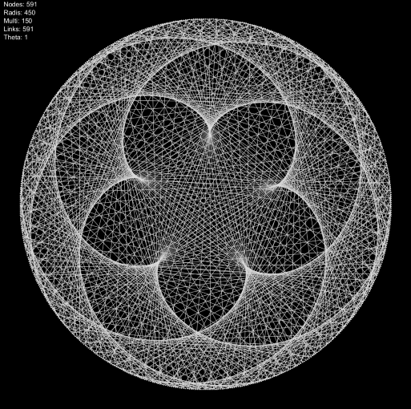

# simple_spiderweb
A short processing sketch for modulo arithmetic visualisation. 

## QuickStart

1. [Download Processing form the Processing Foundation](https://processing.org/)
2. Open Main.pde from within Processing
3. Click Run.

## Modifying the Visualisation

#### Basics

Below is the main guts of the code.
On each loop 5 variables generate a new network.
Modifying these variables each pass allows you to change how the visualisation evolves over time.
Notice, in this simple example, we increment the int lp to evolve the sketch each pass.

```java
  lp = lp + 1;
  
  int nd = lp; //NetworkSize
  int ru = 450; //Radius
  int ml = 2; //Multiplier
  int dp = lp; //Depth
  int th = 0; //Rotation

  net = new Network(nd, ru, ml, dp, th);
  ```

#### Simple Example

Suppose a simple function that takes lp and return the cosine of lp.

```java
int my_cos_func(int k, int m) {
	return floor(abs(cos(k) * m));
}
```

We can use this to oscilate the size of our sketch like so:

```java
lp = lp + 1;
int ru = my_cos_func(lp, 450); //Radius
```

## Visualisations




## Acknowledgments

As best as I can tell this is [The Original Paper by Simon Plouffe](http://xahlee.info/SpecialPlaneCurves_dir/Cardioid_dir/_p/LightsRaysReflections.pdf). I discovered this phenomenon in [This Video by Mathologer](https://www.youtube.com/watch?v=qhbuKbxJsk8s). There Mathologer links [Other Fabulous Visulisation by Mathias Lengler](https://lengler.dev/TimesTableWebGL/).
Lastly, I wanted to share [This Beautiful 2005 installation by Grace Weir](http://www.graceweir.com/page31/page31.html).


## License and Contribution

MIT License Applies.
Contributions welcome as git-branches.
Thank you.